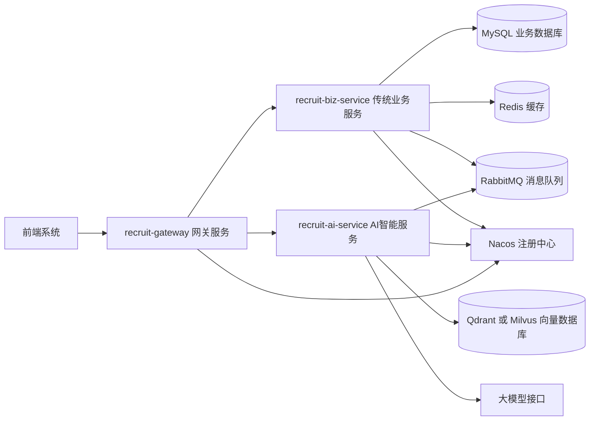
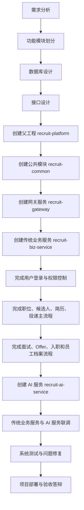
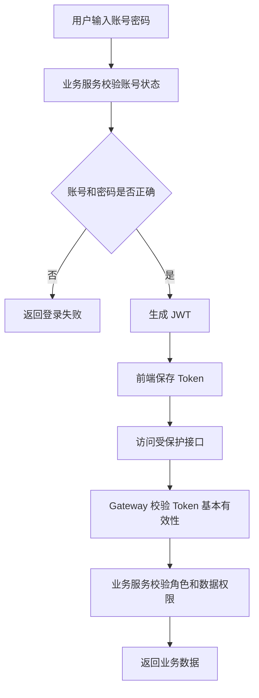
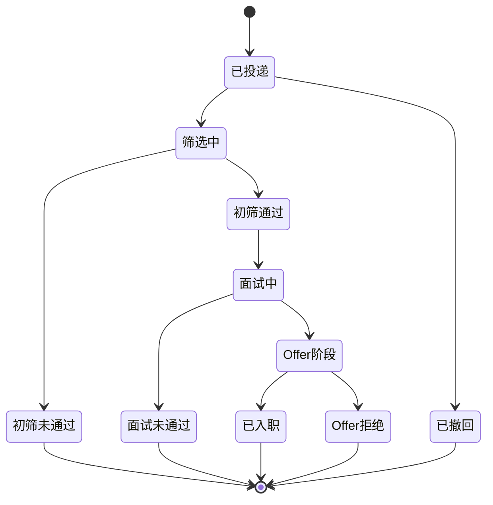
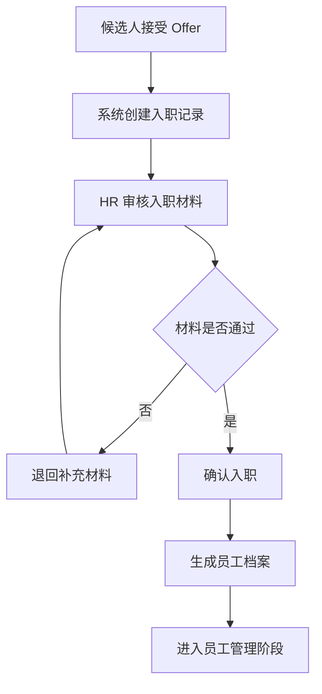
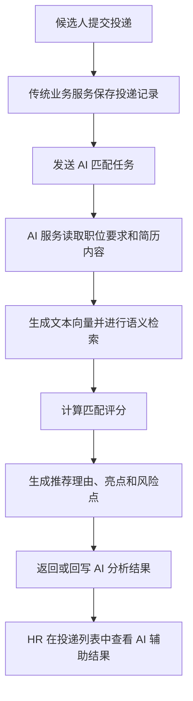

# 招聘与人才管理平台

# 软件需求规格说明书

武汉理工大学 2023zy1 班集中实习项目第 9 组

| 版本号 | 时间 | 小组成员 |
|---|---|---|
| v1.0 | 2026-07-07 | 第 9 组成员 |

## 目录

- 第一章 引言
  - 1.1 编写目的
  - 1.2 软件需求分析理论
  - 1.3 软件需求分析目标
  - 1.4 参考文献
- 第二章 需求概述
  - 2.1 项目背景
  - 2.2 需求概述
  - 2.3 开发流程
- 第三章 功能需求
  - 3.1 用户与权限管理模块
  - 3.2 职位、候选人与简历管理模块
  - 3.3 投递筛选、面试与录用管理模块
  - 3.4 入职流程与员工档案管理模块
  - 3.5 AI 智能辅助模块
  - 3.6 系统管理与消息通知模块
- 第四章 非功能需求
  - 4.1 性能需求
  - 4.2 安全性需求
  - 4.3 扩展性需求

## 第一章 引言

### 1.1 编写目的

本文档用于明确“招聘与人才管理平台”的软件需求，说明系统建设背景、用户角色、业务流程、功能范围、非功能要求以及后续开发边界。文档面向项目小组成员、需求分析人员、后端开发人员、前端开发人员、测试人员和项目验收人员。

通过编写本需求规格说明书，可以使项目组在正式开发前统一系统目标和业务范围，减少后续开发中由于需求理解不一致造成的返工。本文档也将作为后续概要设计、数据库设计、接口设计、编码实现、测试验收和项目答辩的重要依据。

本项目后端采用微服务架构。结合实训周期限制，系统后端主要划分为传统业务域和 AI 智能域两个核心微服务，并通过网关提供统一访问入口。

### 1.2 软件需求分析理论

软件需求分析是软件工程中的关键阶段，主要任务是从用户业务场景出发，识别系统需要完成的功能、需要满足的性能约束、安全约束、数据约束和运行环境约束。需求分析的结果应具有明确性、完整性、一致性、可验证性和可追踪性。

一个规范的软件需求说明书通常包括引言、需求概述、功能需求和非功能需求等内容。其中，功能需求用于描述系统必须提供的业务能力，例如用户登录、职位发布、简历投递、面试安排等；非功能需求用于描述系统运行质量要求，例如响应速度、安全性、扩展性、可维护性和可靠性等。

本项目需求分析遵循“先业务流程，后系统功能，再技术支撑”的原则。首先梳理招聘与人才管理的真实业务流程，再抽象系统角色和功能模块，最后结合微服务、数据库、消息队列、缓存和 AI 服务设计系统实现边界。

### 1.3 软件需求分析目标

本次需求分析的目标如下：

| 序号 | 目标 |
|---|---|
| 1 | 明确招聘与人才管理平台的项目背景、服务对象和建设范围。 |
| 2 | 明确系统用户角色，包括系统管理员、HR、面试官和候选人。 |
| 3 | 明确传统业务域的核心流程，包括职位发布、简历接收、投递筛选、面试安排、Offer 管理、入职流程和员工档案管理。 |
| 4 | 明确 AI 智能域的辅助能力，包括简历与职位匹配评分、智能面试问答生成、面试反馈摘要和员工离职倾向预测。 |
| 5 | 明确系统采用微服务架构，并将后端划分为网关服务、公共模块、传统业务服务和 AI 服务。 |
| 6 | 明确系统开发优先级，优先完成可演示、可验收的招聘主流程。 |
| 7 | 为后续数据库设计、接口设计、后端编码、前端页面开发和测试验收提供依据。 |

### 1.4 参考文献

| 序号 | 资料名称 | 说明 |
|---|---|---|
| 1 | 《软件工程基础》 | 软件工程与需求分析理论参考。 |
| 2 | 《软件需求》 | 软件需求规格说明书编写参考。 |
| 3 | 《实用软件工程》 | 软件开发过程与需求建模参考。 |
| 4 | 《SpringCloud Alibaba 实战指南-1.pdf》 | 微服务实训课程参考资料。 |
| 5 | 《集中实习项目选题文档》 | 本项目选题来源。 |
| 6 | 老师提供的需求规格说明书参考模板 | 本文档结构与格式参考。 |

## 第二章 需求概述

### 2.1 项目背景

企业招聘和人才管理通常包含职位发布、简历接收、简历筛选、面试安排、Offer 发放、入职办理和员工档案维护等环节。传统招聘流程中，HR 需要手动整理大量简历、逐个筛选候选人、安排多轮面试、记录面试反馈并跟进入职进度，工作量大且流程容易分散。

随着企业招聘规模扩大，传统人工筛选方式容易出现以下问题：

| 问题 | 说明 |
|---|---|
| 简历筛选效率低 | HR 需要人工阅读大量简历，重复性工作较多。 |
| 筛选标准不统一 | 不同 HR 或面试官对候选人的判断标准可能不同。 |
| 面试安排复杂 | 候选人、HR 和面试官时间容易冲突。 |
| 招聘流程追踪困难 | 候选人从投递到入职涉及多个状态，人工记录容易遗漏。 |
| 人才数据利用不足 | 历史投递、面试反馈和员工档案没有形成有效沉淀。 |
| AI 能力难以接入 | 简历匹配、面试题生成、反馈摘要等智能能力缺少统一入口。 |

因此，本项目拟建设一个“招聘与人才管理平台”，通过信息化系统规范招聘流程，并引入 AI 智能辅助能力，提升 HR 工作效率和人才管理质量。

### 2.2 需求概述

招聘与人才管理平台面向企业招聘业务场景，系统主要支持 HR、面试官、候选人和系统管理员四类用户。系统核心业务从 HR 发布职位开始，候选人上传简历并投递职位，HR 结合 AI 匹配结果进行筛选，面试官提交面试反馈，HR 发放 Offer，候选人接受后进入入职流程，最终转为员工档案。

系统采用前后端分离和微服务架构。前端统一访问网关服务，网关根据请求路径将业务转发到传统业务服务或 AI 服务。传统业务服务负责招聘业务主流程和数据落库，AI 服务负责简历匹配、面试问题生成、面试反馈摘要和离职倾向预测。

#### 2.2.1 系统角色

| 角色 | 角色说明 | 主要职责 |
|---|---|---|
| 系统管理员 | 负责系统基础数据和账号管理。 | 管理用户、角色、基础配置和系统运行数据。 |
| HR | 招聘流程主要操作人员。 | 发布职位、筛选简历、安排面试、管理 Offer、办理入职、维护员工档案。 |
| 面试官 | 负责参与候选人面试并提交评价。 | 查看面试任务、查看候选人资料、填写面试反馈和录用建议。 |
| 候选人 | 应聘人员。 | 注册登录、维护个人资料、上传简历、投递职位、查看流程状态和 Offer。 |

#### 2.2.2 系统总体架构图

#### 2.2.3 系统核心业务流程图

核心业务流程采用泳道图表示。图中按角色划分为“候选人端、后台管理系统、AI 智能服务”三类泳道，并按业务阶段划分为“职位发布、简历投递、筛选面试、Offer 入职”四个阶段。

#### 2.2.4 系统核心数据对象

| 数据对象 | 说明 | 所属业务域 |
|---|---|---|
| 用户 | 保存系统登录账号、密码、角色和状态。 | 传统业务域 |
| 角色 | 保存系统角色，例如管理员、HR、面试官、候选人。 | 传统业务域 |
| 职位 | 保存职位名称、部门、地点、薪资、职责、要求和招聘状态。 | 传统业务域 |
| 候选人 | 保存应聘人员基础信息。 | 传统业务域 |
| 简历 | 保存候选人上传的简历文件、简历文本和解析结果。 | 传统业务域 |
| 投递记录 | 连接候选人、简历和职位，是招聘流程的核心业务记录。 | 传统业务域 |
| 面试安排 | 保存面试时间、面试官、面试方式、地点和面试状态。 | 传统业务域 |
| 面试反馈 | 保存面试官评分、评价内容和录用建议。 | 传统业务域 |
| Offer | 保存录用薪资、入职日期、工作地点和 Offer 状态。 | 传统业务域 |
| 入职记录 | 保存入职流程、材料审核和办理状态。 | 传统业务域 |
| 员工档案 | 保存入职后的员工基础资料、岗位和在职状态。 | 传统业务域 |
| AI 分析结果 | 保存匹配评分、推荐理由、面试题、反馈摘要和离职风险预测结果。 | AI 智能域 |

#### 2.2.5 微服务划分

| 模块 | 类型 | 主要职责 |
|---|---|---|
| recruit-gateway | 网关服务 | 提供统一访问入口，负责路由转发、跨域处理、基础 Token 校验和限流扩展。 |
| recruit-common | 公共模块 | 提供统一返回结果、异常处理、错误码、枚举、工具类和通用 DTO。 |
| recruit-biz-service | 传统业务微服务 | 负责用户权限、职位、候选人、简历、投递、面试、Offer、入职和员工档案等核心业务。 |
| recruit-ai-service | AI 智能微服务 | 负责简历匹配评分、面试问题生成、反馈摘要和离职倾向预测等 AI 能力。 |

说明：本项目虽然采用微服务架构，但考虑实训周期有限，不将每个业务模块拆成独立微服务，而是按照“传统业务域”和“AI 智能域”进行服务拆分。这样既能体现微服务思想，又能控制项目复杂度。

### 2.3 开发流程

本项目开发流程遵循“需求分析、设计先行、分阶段实现、持续测试”的原则。开发时应先搭建父工程、公共模块和网关服务，再完成传统业务服务的核心流程，最后与 AI 服务进行接口联调。

#### 2.3.1 项目开发流程图

#### 2.3.2 阶段安排

| 阶段 | 开发内容 | 产出物 |
|---|---|---|
| 第一阶段 | 完成需求分析、数据库设计、接口设计和项目父工程搭建。 | 需求文档、数据库设计文档、接口草案、后端工程结构。 |
| 第二阶段 | 完成用户权限、职位管理、候选人管理、简历管理和投递管理。 | 传统业务服务核心接口。 |
| 第三阶段 | 完成面试安排、面试反馈、Offer 管理、入职流程和员工档案。 | 招聘主流程闭环。 |
| 第四阶段 | 完成 Gateway、Nacos、Feign、Redis、RabbitMQ 等微服务组件接入。 | 可运行的微服务系统。 |
| 第五阶段 | 与 AI 服务联调，完成简历匹配、面试题生成、反馈摘要和离职风险预测。 | AI 辅助功能接口与演示数据。 |
| 第六阶段 | 完成系统测试、Bug 修复、项目文档整理和答辩材料准备。 | 测试结果、最终项目代码、演示文档。 |

## 第三章 功能需求

### 3.1 用户与权限管理模块

用户与权限管理模块用于支持系统登录认证、角色识别和权限控制。系统采用账号密码登录方式，登录成功后返回 JWT，后续请求通过请求头携带 Token 访问系统接口。

系统需要设计用户表和角色表。用户表保存登录账号、密码、真实姓名、手机号、邮箱、角色和账号状态；角色表保存角色编码和角色名称。候选人、HR、面试官等业务身份不直接复用用户表，而是通过业务表保存详细信息。

| 编号 | 功能名称 | 需求说明 | 优先级 |
|---|---|---|---|
| 3.1.1 | 用户登录 | 用户输入账号和密码后，系统校验身份并返回 JWT。 | P0 |
| 3.1.2 | 用户退出 | 用户退出登录后，前端清除 Token；后续可扩展 Redis 黑名单。 | P1 |
| 3.1.3 | 角色管理 | 系统支持管理员、HR、面试官、候选人四类角色。 | P0 |
| 3.1.4 | 权限控制 | 不同角色只能访问授权范围内的功能。 | P0 |
| 3.1.5 | 用户管理 | 管理员可以创建、编辑、禁用系统用户。 | P1 |
| 3.1.6 | 数据隔离 | 候选人只能查看自己的简历、投递记录和 Offer。 | P0 |

用户权限流程如下图所示：

### 3.2 职位、候选人与简历管理模块

职位、候选人与简历管理模块是招聘业务的基础模块。HR 需要先创建职位并发布，候选人才能针对职位投递简历。候选人信息既可以由候选人注册后维护，也可以由 HR 手动录入。简历应单独设计表保存，允许一个候选人维护多份简历。

#### 3.2.1 职位管理

| 编号 | 功能名称 | 需求说明 | 优先级 |
|---|---|---|---|
| 3.2.1.1 | 创建职位 | HR 可以填写职位名称、部门、地点、薪资范围、招聘人数、岗位职责和任职要求。 | P0 |
| 3.2.1.2 | 发布职位 | 职位创建后可设置为招聘中，对候选人开放。 | P0 |
| 3.2.1.3 | 查询职位 | 支持按照关键字、部门、地点和状态查询职位。 | P0 |
| 3.2.1.4 | 编辑职位 | HR 可以修改未关闭职位的基本信息。 | P0 |
| 3.2.1.5 | 关闭职位 | 职位关闭后不再接收新的投递。 | P0 |

第一版职位管理可以只设计职位表，部门先作为职位字段保存。若后续需要组织架构管理，再扩展部门表。

#### 3.2.2 候选人管理

| 编号 | 功能名称 | 需求说明 | 优先级 |
|---|---|---|---|
| 3.2.2.1 | 候选人注册 | 候选人可以注册账号并维护个人信息。 | P0 |
| 3.2.2.2 | HR 录入候选人 | HR 可以手动录入候选人基础资料。 | P0 |
| 3.2.2.3 | 候选人查询 | HR 可以按照姓名、手机号、学历、学校和工作年限查询候选人。 | P0 |
| 3.2.2.4 | 候选人详情 | HR 可以查看候选人的基本资料、简历列表和历史投递记录。 | P0 |
| 3.2.2.5 | 重复候选人提醒 | 系统通过手机号或邮箱判断候选人是否重复。 | P1 |

候选人不应直接复用用户表。用户表只负责登录认证，候选人表保存招聘业务资料。这样可以支持 HR 手动录入未注册账号的候选人，也能避免登录账号字段和候选人业务字段混杂。

#### 3.2.3 简历管理

| 编号 | 功能名称 | 需求说明 | 优先级 |
|---|---|---|---|
| 3.2.3.1 | 上传简历 | 候选人可以上传 PDF、Word 等格式的简历文件。 | P0 |
| 3.2.3.2 | 创建文本简历 | 候选人或 HR 可以录入文本简历内容。 | P0 |
| 3.2.3.3 | 多简历管理 | 一个候选人可以拥有多份简历。 | P0 |
| 3.2.3.4 | 默认简历 | 候选人可以设置默认简历。 | P1 |
| 3.2.3.5 | 简历解析 | 系统保存简历解析文本、技能关键词和项目经历摘要。 | P1 |

### 3.3 投递筛选、面试与录用管理模块

投递记录是招聘流程的核心数据。候选人投递职位时，系统需要保存职位、候选人、简历、投递时间和当前状态。HR 根据投递记录进行筛选，筛选通过后安排面试，面试通过后创建 Offer。

#### 3.3.1 投递与筛选管理

| 编号 | 功能名称 | 需求说明 | 优先级 |
|---|---|---|---|
| 3.3.1.1 | 职位投递 | 候选人选择职位和简历后提交投递。 | P0 |
| 3.3.1.2 | 多岗位投递 | 候选人可以投递多个不同岗位。 | P0 |
| 3.3.1.3 | 重复投递限制 | 同一候选人对同一职位不允许重复投递。 | P0 |
| 3.3.1.4 | 岗位调剂选择 | 候选人投递时可以选择是否接受岗位调剂。 | P1 |
| 3.3.1.5 | 投递列表 | HR 可以查看某职位下所有投递记录。 | P0 |
| 3.3.1.6 | AI 评分展示 | HR 查看投递列表时可以看到 AI 匹配分、推荐理由、亮点和风险提示。 | P1 |
| 3.3.1.7 | 筛选处理 | HR 可以将投递记录设置为通过、拒绝或待定。 | P0 |
| 3.3.1.8 | 拒绝原因记录 | HR 拒绝候选人时需要选择拒绝原因并填写备注。 | P1 |

投递状态流转如下图所示：

#### 3.3.2 面试管理

| 编号 | 功能名称 | 需求说明 | 优先级 |
|---|---|---|---|
| 3.3.2.1 | 创建面试安排 | HR 为初筛通过的投递记录创建面试。 | P0 |
| 3.3.2.2 | 面试信息维护 | 面试安排包含面试时间、面试官、面试方式、地点或会议链接。 | P0 |
| 3.3.2.3 | 面试任务查询 | 面试官可以查看分配给自己的面试任务。 | P0 |
| 3.3.2.4 | 面试冲突校验 | 系统校验同一面试官或候选人同一时间段是否已有面试。 | P1 |
| 3.3.2.5 | 面试反馈提交 | 面试官提交评分、评价内容和录用建议。 | P0 |
| 3.3.2.6 | 面试反馈摘要 | AI 根据面试反馈生成结构化摘要。 | P1 |

#### 3.3.3 Offer 管理

| 编号 | 功能名称 | 需求说明 | 优先级 |
|---|---|---|---|
| 3.3.3.1 | 创建 Offer | HR 为通过面试的候选人创建 Offer。 | P0 |
| 3.3.3.2 | Offer 信息维护 | Offer 包含薪资、入职日期、试用期、工作地点和备注。 | P0 |
| 3.3.3.3 | Offer 发送 | HR 可以将 Offer 状态设置为已发送。 | P0 |
| 3.3.3.4 | Offer 接受或拒绝 | 候选人可以接受或拒绝 Offer。 | P0 |
| 3.3.3.5 | Offer 撤回 | HR 可以在候选人接受前撤回 Offer。 | P1 |

### 3.4 入职流程与员工档案管理模块

当候选人接受 Offer 后，系统进入入职流程。入职完成后，候选人信息需要转化为员工档案，用于后续人才管理和离职倾向预测。

| 编号 | 功能名称 | 需求说明 | 优先级 |
|---|---|---|---|
| 3.4.1 | 创建入职流程 | 候选人接受 Offer 后，系统创建入职记录。 | P0 |
| 3.4.2 | 入职材料维护 | HR 维护候选人入职所需材料和审核状态。 | P1 |
| 3.4.3 | 入职状态流转 | 入职流程支持待提交、审核中、已通过、已入职和已取消等状态。 | P0 |
| 3.4.4 | 员工档案生成 | 入职完成后，系统根据候选人和 Offer 信息生成员工档案。 | P0 |
| 3.4.5 | 员工档案查询 | HR 可以查询员工基础信息、部门、岗位、入职日期和在职状态。 | P0 |
| 3.4.6 | 员工状态维护 | HR 可以维护员工试用、在职、离职等状态。 | P1 |

入职转员工档案流程如下图所示：

### 3.5 AI 智能辅助模块

AI 智能辅助模块用于提升招聘效率，但 AI 结果只作为 HR 和面试官的辅助参考，不直接决定候选人的录用结果。AI 服务应与传统业务服务分离，传统业务服务负责保存最终业务状态。

| 编号 | 功能名称 | 需求说明 | 优先级 |
|---|---|---|---|
| 3.5.1 | 简历与职位匹配评分 | AI 根据职位要求和简历内容计算匹配分。 | P0 |
| 3.5.2 | 推荐理由生成 | AI 生成候选人亮点、风险点和推荐理由。 | P1 |
| 3.5.3 | 智能面试问题生成 | AI 根据候选人经历和职位要求生成面试问题。 | P1 |
| 3.5.4 | 面试反馈自动摘要 | AI 根据面试官反馈生成结构化摘要。 | P1 |
| 3.5.5 | 员工离职倾向预测 | AI 根据员工行为数据、反馈文本和绩效信息预测离职风险。 | P2 |
| 3.5.6 | AI 任务记录 | 系统保存 AI 调用时间、输入摘要、输出结果、状态和失败原因。 | P1 |

AI 匹配流程如下图所示：

### 3.6 系统管理与消息通知模块

系统管理模块用于支持系统运行、基础配置和消息提醒。考虑项目实训周期，第一版可以优先实现站内通知，不必设计复杂聊天窗口。

| 编号 | 功能名称 | 需求说明 | 优先级 |
|---|---|---|---|
| 3.6.1 | 站内通知 | 系统在投递、面试、Offer、入职等关键节点生成站内通知。 | P1 |
| 3.6.2 | 未读数量 | 用户可以查看未读消息数量。 | P1 |
| 3.6.3 | 消息已读 | 用户可以将单条或全部消息标记为已读。 | P1 |
| 3.6.4 | 操作日志 | 系统记录关键业务操作人、操作时间和操作内容。 | P2 |
| 3.6.5 | 基础配置 | 管理员维护职位状态、拒绝原因、面试方式等基础字典。 | P2 |

通知场景包括：候选人投递成功、HR 筛选通过或拒绝、面试安排创建、面试反馈提交、Offer 发送、Offer 接受、入职材料审核等。

## 第四章 非功能需求

### 4.1 性能需求

系统应满足实训项目演示和基础并发访问需求。由于本项目属于教学实训项目，性能目标以稳定完成演示、接口响应正常、流程可用为主。

#### 4.1.1 处理能力

| 项目 | 要求 |
|---|---|
| 支持用户规模 | 支持不少于 200 个用户账号。 |
| 支持职位规模 | 支持不少于 500 条职位数据。 |
| 支持候选人规模 | 支持不少于 5000 条候选人数据。 |
| 支持投递记录规模 | 支持不少于 10000 条投递记录。 |
| 常规并发访问 | 支持 50 个用户同时访问核心业务接口。 |
| AI 任务处理 | AI 匹配、摘要和预测任务允许异步处理。 |

#### 4.1.2 响应时间

| 场景 | 响应时间要求 |
|---|---|
| 登录接口 | 正常情况下 1 秒内返回结果。 |
| 职位列表、候选人列表、投递列表查询 | 正常情况下 2 秒内返回结果。 |
| 新增、修改、删除类业务接口 | 正常情况下 2 秒内返回结果。 |
| 简历文件上传 | 正常情况下 5 秒内完成上传。 |
| AI 匹配评分 | 同步调用时 10 秒内返回；异步调用时允许后台处理。 |
| 复杂统计查询 | 正常情况下 5 秒内返回结果。 |

#### 4.1.3 稳定性要求

| 项目 | 要求 |
|---|---|
| 核心流程可用性 | 职位发布、简历投递、筛选、面试、Offer 和入职流程应保持可用。 |
| AI 服务异常处理 | AI 服务异常不应影响候选人投递和 HR 基础筛选。 |
| 数据一致性 | 投递状态、面试状态、Offer 状态和入职状态应保持合理流转。 |

### 4.2 安全性需求

#### 4.2.1 网络安全

系统应通过网关统一暴露接口，避免后端业务服务直接暴露过多访问入口。网关负责基础跨域配置、请求转发和 Token 初步校验。生产环境中应使用 HTTPS 保障传输安全，实训环境中可根据部署条件简化。

#### 4.2.2 应用系统安全

| 项目 | 要求 |
|---|---|
| 登录认证 | 系统采用账号密码登录，登录成功后签发 JWT。 |
| 密码存储 | 用户密码必须使用 BCrypt 等不可逆方式加密存储。 |
| 角色权限 | 系统按照管理员、HR、面试官、候选人进行角色权限控制。 |
| 接口鉴权 | 非公开接口必须校验 Token 和用户角色。 |
| 数据权限 | 候选人只能访问自己的简历、投递记录和 Offer；面试官只能访问分配给自己的面试任务。 |
| 防止越权 | 后端接口不能只依赖前端隐藏按钮，必须在服务端校验权限。 |

#### 4.2.3 数据传输安全

系统接口传输敏感数据时应避免在 URL 中直接暴露密码、身份证号等敏感字段。登录请求、简历上传和 Offer 信息传输应通过请求体传递。系统日志中不得打印用户密码、完整 Token、身份证号、完整手机号等敏感信息。

#### 4.2.4 数据隐私安全

招聘系统涉及候选人简历、手机号、邮箱、薪资、面试评价和员工档案等敏感信息。系统应控制数据访问范围，避免候选人资料被无关用户查看。AI 服务处理简历和员工信息时，应只传递必要字段，并保存 AI 调用记录，便于后续追踪。

### 4.3 扩展性需求

本项目需要具备一定扩展能力，便于后续在实训过程中继续增加功能。

| 扩展方向 | 设计要求 |
|---|---|
| 微服务扩展 | 当前只拆分传统业务服务和 AI 服务，后续可继续拆分用户服务、招聘服务、员工服务等。 |
| 权限扩展 | 当前采用用户表和角色表，后续可扩展权限表、角色权限表和菜单权限。 |
| 业务扩展 | 职位、候选人、简历、投递、面试、Offer 和员工档案应保持清晰关联，便于增加审批流、统计报表和人才库功能。 |
| AI 扩展 | AI 服务与业务服务分离，后续可替换模型、增加 RAG 知识库、扩展简历比对和候选人推荐。 |
| 缓存扩展 | Redis 可用于验证码、Token 黑名单、热点职位缓存、权限缓存和接口限流。 |
| 消息扩展 | RabbitMQ 可用于投递后异步匹配、面试通知、Offer 通知和 AI 任务处理。 |
| 向量库扩展 | Qdrant 或 Milvus 可用于保存简历片段、职位要求和面试知识库向量。 |
| 部署扩展 | 后续可使用 Docker Compose 管理 MySQL、Redis、RabbitMQ、Nacos、网关和业务服务。 |

系统扩展时应遵循“核心业务状态由传统业务服务维护，AI 服务只提供辅助分析结果”的原则，避免 AI 服务直接修改招聘主流程状态。
