# 招聘与人才管理平台

# 软件系统设计说明书（图示重写版）

武汉理工大学 2023zy1 班集中实习项目第 9 组

| 版本号 | 日期 | 小组成员 | 说明 |
|---|---|---|---|
| v1.0 | 2026-07-15 | 第 9 组成员 | 根据需求规格说明书、现有工程和数据库脚本重新编写。 |

## 目录

- 第一章 引言
- 第二章 设计概述
- 第三章 系统概要设计
- 第四章 系统详细设计
- 第五章 总结

## 第一章 引言

### 1.1 编写目的

本文档以《招聘与人才管理平台-需求规格说明书》为基础，对系统的技术架构、功能模块、页面结构、业务流程和数据库结构进行设计。文档用于指导前端开发、后端开发、数据库建设、接口联调和系统测试。

### 1.2 设计范围

系统服务于系统管理员、HR、面试官和候选人四类用户，覆盖以下主要业务：

1. 用户登录、角色识别和权限控制。
2. 职位发布、候选人管理和简历管理。
3. 职位投递、简历筛选和面试安排。
4. 面试反馈、Offer、入职办理和员工档案。
5. 简历匹配、面试问题、反馈摘要和离职风险等 AI 辅助功能。

AI 只提供评分、摘要、建议和风险提示，不得直接决定候选人的筛选、录用和入职状态。最终业务状态由传统业务服务和授权用户控制。

### 1.3 参考资料

| 资料 | 用途 |
|---|---|
| 《招聘与人才管理平台-需求规格说明书》 | 业务角色、功能和非功能需求依据。 |
| `recruit-smart-backend/sql/recruit_smart_init.sql` | 数据库表、字段、索引和演示数据依据。 |
| `recruit-smart-backend/pom.xml` | 后端模块和技术版本依据。 |
| `recruit-smart-frontend/package.json` | 前端技术栈依据。 |
| `recruit-smart-frontend/design.md` | 页面视觉和交互规范依据。 |

### 1.4 术语说明

| 术语 | 说明 |
|---|---|
| JWT | 用户登录成功后获取的身份令牌。 |
| RBAC | 基于角色的访问控制。 |
| DTO | 接收和校验接口参数的数据对象。 |
| VO | 返回给前端的视图数据对象。 |
| 逻辑外键 | 数据库未声明物理外键，但业务字段之间存在引用关系，由 Service 校验。 |
| Offer | 企业向候选人发出的录用通知。 |
| AI 辅助结果 | AI 生成的评分、理由、摘要或风险提示，不代表最终决定。 |

## 第二章 设计概述

### 2.1 设计目标

- 建立从职位发布到员工入职的完整招聘流程。
- 保证系统管理员、HR、面试官和候选人的权限边界清晰。
- 保证职位、投递、面试、Offer 和入职状态按规则流转。
- 将招聘业务服务与 AI 服务分离，避免 AI 服务异常影响主流程。
- 使数据库表、接口和页面模块之间具有清晰的对应关系。

### 2.2 设计原则

1. **业务状态唯一**：最终状态只由 `recruit-biz-service` 维护。
2. **AI 人工确认**：AI 输出必须经过 HR 或面试官判断，不能自动录用或拒绝。
3. **前后端分离**：前端通过 Gateway 访问后端 REST 接口。
4. **数据分层**：登录账号使用 `sys_user`，候选人业务资料使用 `candidate`。
5. **状态受控**：所有状态变化由业务方法完成，前端不能任意修改状态字段。
6. **敏感信息保护**：简历、薪资、面试评价和员工档案按最小权限访问。

### 2.3 系统角色

| 角色 | 主要职责 | 数据范围 |
|---|---|---|
| 系统管理员 | 管理用户、角色和系统基础配置。 | 全局系统数据。 |
| HR | 管理职位、候选人、筛选、面试、Offer、入职和员工档案。 | 企业招聘业务数据。 |
| 面试官 | 查看面试任务并提交评价。 | 仅分配给本人的面试和候选人资料。 |
| 候选人 | 维护资料和简历，投递职位，处理 Offer。 | 仅本人资料、简历、投递和 Offer。 |

### 2.4 技术选型

| 层次 | 技术 |
|---|---|
| 前端 | Vue 3、TypeScript、Vite、Vue Router、Pinia、Axios、Element Plus。 |
| 网关 | Spring Cloud Gateway。 |
| 后端 | Java 21、Spring Boot 3.2、Spring Cloud、MyBatis-Plus。 |
| 数据库 | MySQL 8.x。 |
| 微服务组件 | Nacos、Feign、Redis、RabbitMQ。 |
| AI 支撑 | 大模型接口、Qdrant 或 Milvus 向量数据库。 |

## 第三章 系统概要设计

### 3.1 系统总体架构

系统采用 B/S 架构和前后端分离模式。浏览器访问 Vue 前端，前端通过 Gateway 调用传统业务服务和 AI 服务。

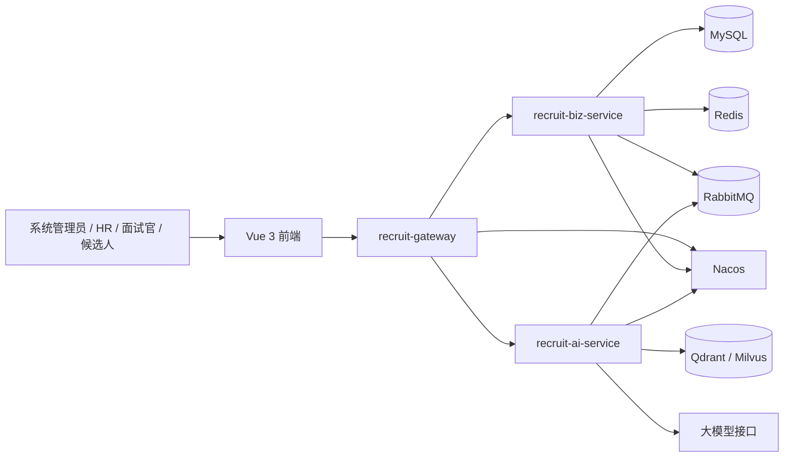

各后端模块职责如下：

| 模块 | 职责 |
|---|---|
| `recruit-gateway` | 统一入口、路由、跨域和 Token 基础校验。 |
| `recruit-common` | 统一响应、分页、异常、JWT 工具和通用类型。 |
| `recruit-biz-service` | 处理用户权限和招聘主流程，保存最终业务状态。 |
| `recruit-ai-service` | 处理简历匹配、问题生成、摘要和风险预测。 |
| `feign-api` | 定义微服务之间的调用契约。 |

### 3.2 系统功能模块

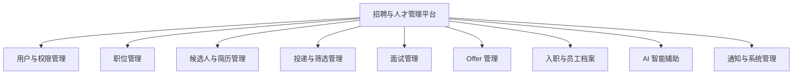

#### 3.2.1 用户与权限管理

该模块负责用户登录、JWT 签发、角色识别、账号启用或禁用以及接口权限校验。候选人登录账号和候选人业务资料分表保存，通过 `candidate.user_id` 关联。

#### 3.2.2 职位管理

HR 创建职位并填写名称、部门、地点、薪资、人数、职责和任职要求。职位状态包括草稿、招聘中、暂停和关闭。只有招聘中的职位可以接收新投递。

#### 3.2.3 候选人与简历管理

候选人可以自注册，也可以由 HR 录入。一个候选人可以维护多份简历，系统保存简历文件地址、解析文本、技能和项目经历摘要。

#### 3.2.4 投递与筛选管理

候选人选择职位和简历提交投递。HR 查看投递记录，并结合简历和 AI 结果进行通过、拒绝或待定处理。同一候选人不能重复投递同一职位。

#### 3.2.5 面试、Offer 和入职管理

HR 为初筛通过的候选人安排面试，面试官提交反馈。HR 根据反馈创建 Offer，候选人接受后进入入职流程。完成入职后生成员工档案。

#### 3.2.6 AI 智能辅助

AI 服务生成简历匹配分、推荐理由、风险提示、面试问题和反馈摘要。AI 输出只能作为辅助信息，所有关键状态变化必须由人工确认。

### 3.3 模块页面概要设计

页面图采用低保真线框表示页面区域和主要操作，不限定最终颜色、字号和组件细节。实际实现仍应遵守 `recruit-smart-frontend/design.md`。

#### 3.3.1 HR 工作台页面

HR 工作台展示开放职位、待筛选候选人、今日面试、AI 待确认事项、招聘流程概览和待办任务。

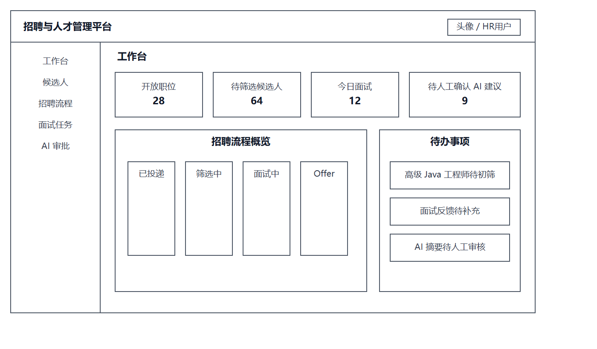

#### 3.3.2 候选人管理页面

候选人页面由筛选区、候选人列表、分页和右侧详情区组成。详情区展示基础资料、简历摘要、历史投递和 AI 辅助摘要。

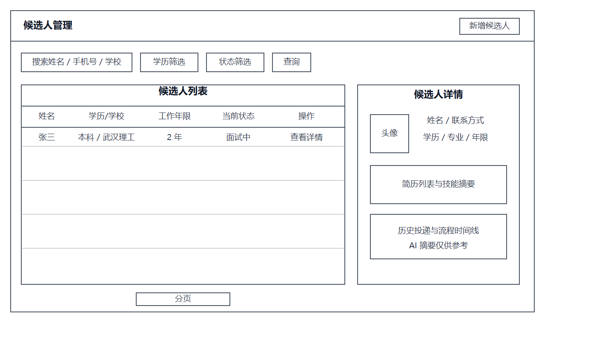

#### 3.3.3 招聘流程看板页面

招聘流程页面按照已投递、筛选中、面试中、Offer 和已入职分栏展示候选人。状态变更操作必须经过人工确认。

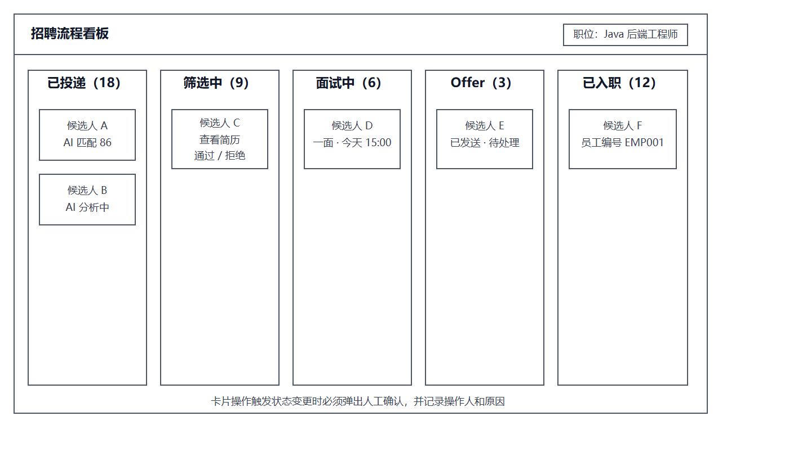

#### 3.3.4 面试任务页面

面试页面包括面试任务列表、候选人简报、AI 问题建议和结构化反馈表。面试官原始评价必须保留。

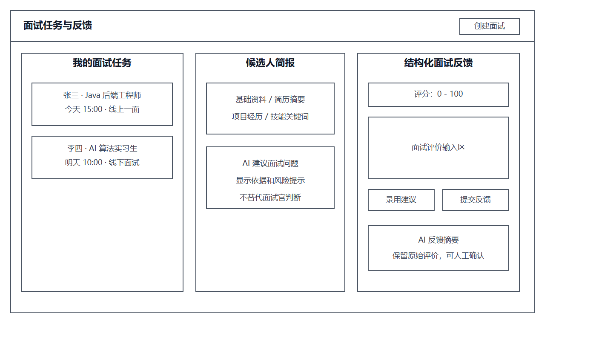

### 3.4 数据库概要设计

数据库名称为 `recruit_smart`，使用 MySQL 8.x 和 `utf8mb4` 字符集。当前初始化脚本包含 12 张核心表。

#### 3.4.1 职位实体属性图

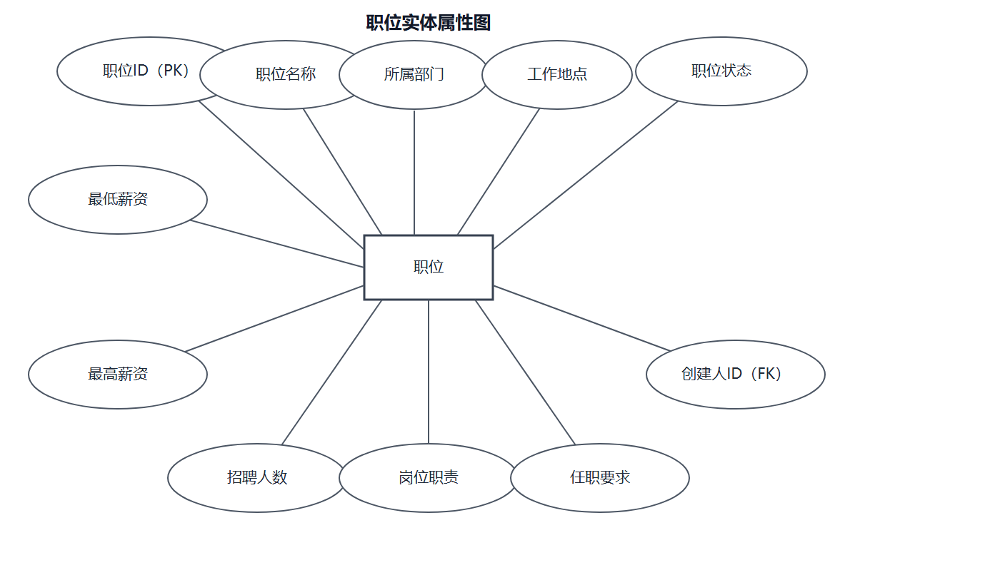

#### 3.4.2 投递记录实体属性图

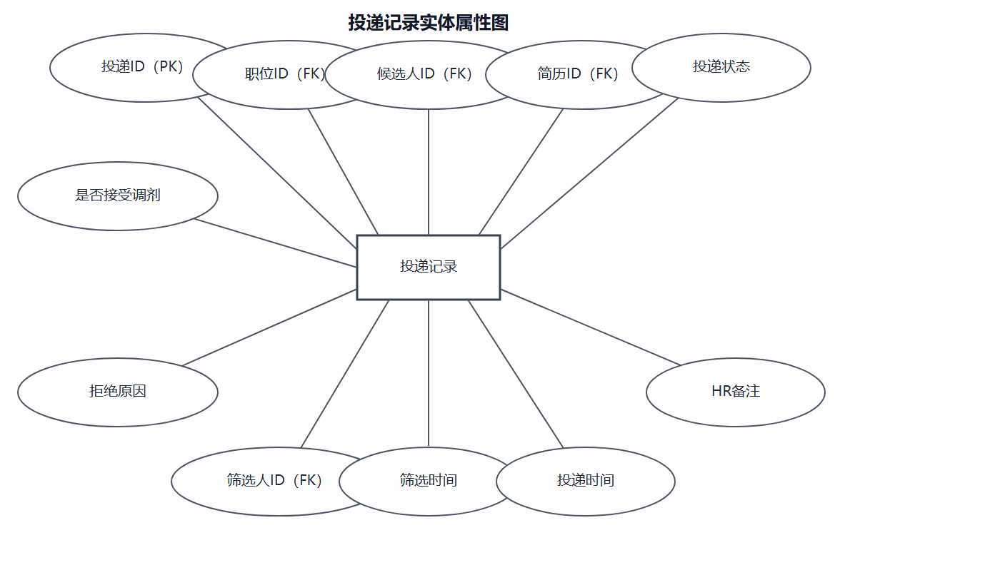

#### 3.4.3 总体 ER 关系图

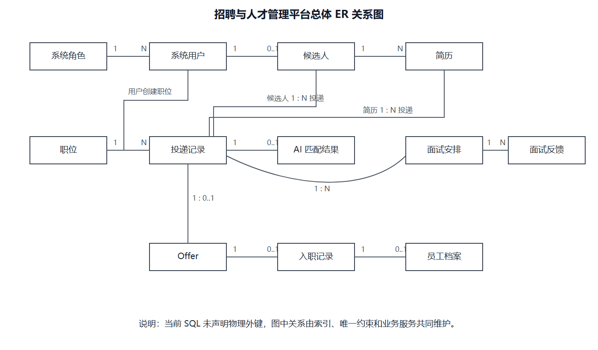

#### 3.4.4 表关系概要

| 主表 | 从表 | 关系 | 关联字段 |
|---|---|---|---|
| `sys_role` | `sys_user` | 一对多 | `sys_user.role_id -> sys_role.id` |
| `sys_user` | `candidate` | 一对零或一 | `candidate.user_id -> sys_user.id` |
| `candidate` | `resume` | 一对多 | `resume.candidate_id -> candidate.id` |
| `job_position` | `job_application` | 一对多 | `job_application.job_id -> job_position.id` |
| `candidate` | `job_application` | 一对多 | `job_application.candidate_id -> candidate.id` |
| `resume` | `job_application` | 一对多 | `job_application.resume_id -> resume.id` |
| `job_application` | `ai_match_result` | 一对零或一 | `ai_match_result.application_id -> job_application.id` |
| `job_application` | `interview` | 一对多 | `interview.application_id -> job_application.id` |
| `interview` | `interview_feedback` | 一对多 | `interview_feedback.interview_id -> interview.id` |
| `job_application` | `offer` | 一对零或一 | `offer.application_id -> job_application.id` |
| `offer` | `onboarding` | 一对零或一 | `onboarding.offer_id -> offer.id` |
| `onboarding` | `employee_profile` | 一对零或一 | `employee_profile.onboarding_id -> onboarding.id` |

> 当前 SQL 使用索引和唯一约束，但没有声明 `FOREIGN KEY`。上述关联属于逻辑外键，由业务服务在新增、修改和删除时校验。

### 3.5 接口概要设计

接口采用 RESTful 风格，普通数据使用 JSON，简历上传使用 `multipart/form-data`。受保护接口通过 `Authorization: Bearer <token>` 携带 JWT。

统一响应结构：

```json
{
  "code": 200,
  "message": "success",
  "data": {}
}
```

主要接口：

| 模块 | 接口 | 说明 |
|---|---|---|
| 登录 | `POST /auth/login` | 用户登录。 |
| 职位 | `GET /jobs`、`POST /jobs` | 查询和创建职位。 |
| 职位 | `PUT /jobs/{id}/publish` | 发布职位。 |
| 候选人 | `GET /candidates` | 查询候选人。 |
| 简历 | `POST /candidates/{id}/resumes` | 上传简历。 |
| 投递 | `POST /applications` | 提交投递。 |
| 筛选 | `PUT /applications/{id}/screen` | HR 处理筛选。 |
| 面试 | `POST /interviews` | 创建面试安排。 |
| 反馈 | `POST /interviews/{id}/feedback` | 提交面试反馈。 |
| Offer | `POST /offers` | 创建 Offer。 |
| 入职 | `PUT /onboardings/{id}/complete` | 确认入职。 |
| AI | `POST /api/ai/resume-match` | 简历与职位匹配。 |

## 第四章 系统详细设计

### 4.1 功能流程详细设计

#### 4.1.1 用户登录流程

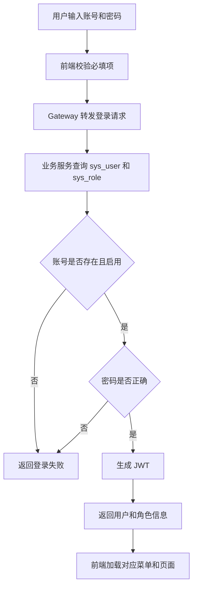

登录失败时使用统一提示，避免泄露账号是否存在。Gateway 只做 Token 基础校验，业务服务负责最终角色和数据权限判断。

#### 4.1.2 投递与筛选流程

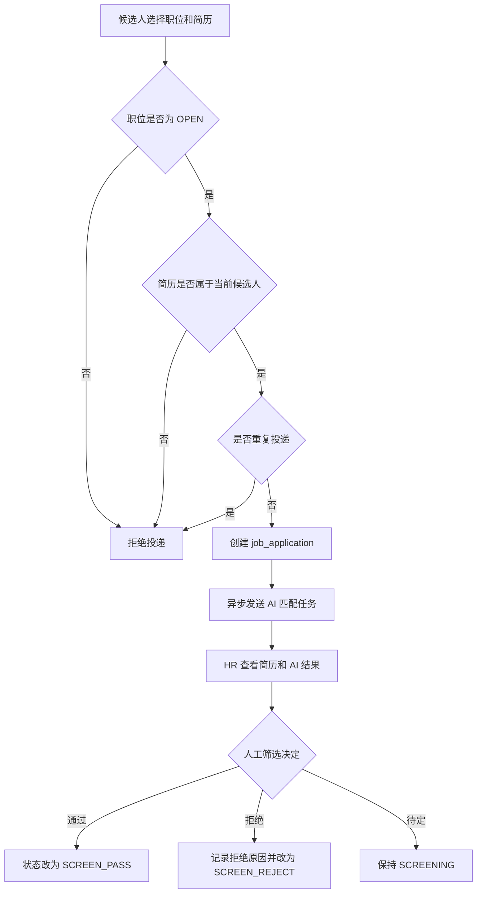

投递状态主要包括 `SUBMITTED`、`SCREENING`、`SCREEN_PASS`、`SCREEN_REJECT`、`INTERVIEWING`、`INTERVIEW_REJECT`、`OFFER`、`HIRED`、`OFFER_REJECTED` 和 `WITHDRAWN`。

#### 4.1.3 面试安排和反馈流程

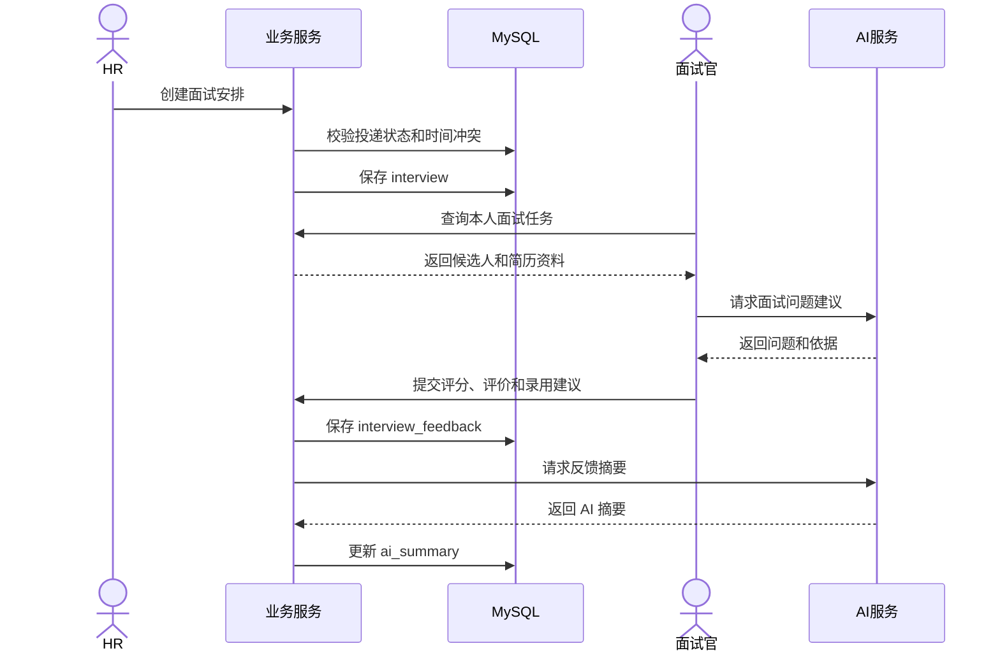

面试官只能查看分配给自己的面试。AI 摘要不能覆盖原始评分、评价和录用建议。

#### 4.1.4 Offer 和入职流程

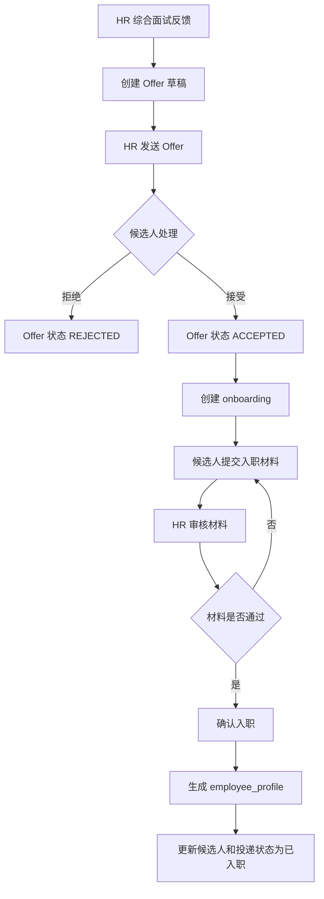

确认入职应在同一数据库事务中更新 `onboarding`、`job_application`、`candidate` 和 `employee_profile`，防止只更新部分数据。

#### 4.1.5 AI 简历匹配流程

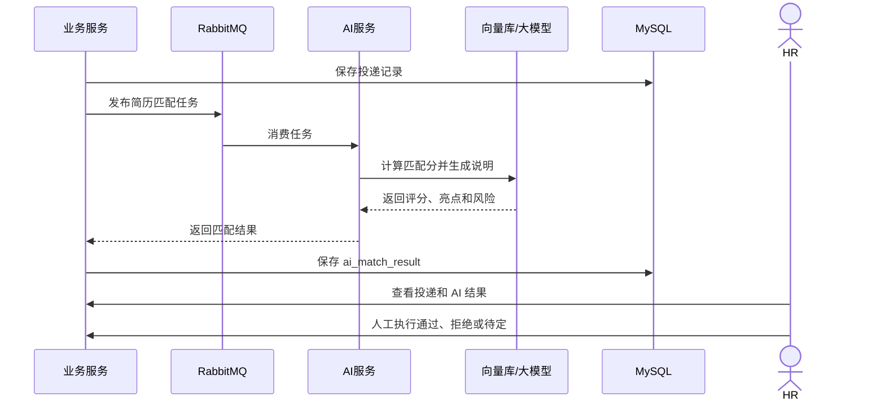

AI 服务异常时，投递记录仍应正常保存，HR 可以继续人工筛选。AI 结果不得直接修改投递状态。

### 4.2 数据库关系详细设计

#### 4.2.1 数据库约束说明

本文使用以下标记：

- `PK`：主键。
- `UK`：唯一索引。
- `IDX`：普通索引。
- `LFK`：逻辑外键，当前 SQL 未声明物理外键。
- `AI`：自动增长。

删除或修改被引用数据时，由 Service 检查逻辑依赖。例如，已存在投递记录的职位不能直接物理删除，已被投递使用的简历也不能随意删除。

#### 4.2.2 `sys_role` 系统角色表

依赖关系：被 `sys_user.role_id` 引用，一条角色记录可关联多个用户。

| 字段 | 类型 | 可空 | 键/默认值 | 依赖关系与说明 |
|---|---|---:|---|---|
| `id` | BIGINT | 否 | PK、AI | 角色主键。 |
| `role_code` | VARCHAR(32) | 否 | UK | 角色编码，如 ADMIN、HR。 |
| `role_name` | VARCHAR(64) | 否 |  | 角色名称。 |
| `description` | VARCHAR(255) | 是 | NULL | 角色说明。 |
| `created_at` | DATETIME | 否 | CURRENT_TIMESTAMP | 创建时间。 |
| `updated_at` | DATETIME | 否 | 自动更新时间 | 更新时间。 |

#### 4.2.3 `sys_user` 系统用户表

依赖关系：`role_id` 逻辑引用 `sys_role.id`；用户可创建职位、候选人、面试和 Offer，也可绑定候选人档案。

| 字段 | 类型 | 可空 | 键/默认值 | 依赖关系与说明 |
|---|---|---:|---|---|
| `id` | BIGINT | 否 | PK、AI | 用户主键。 |
| `username` | VARCHAR(64) | 否 | UK | 登录账号。 |
| `password` | VARCHAR(255) | 否 |  | BCrypt 密码密文。 |
| `real_name` | VARCHAR(64) | 否 |  | 真实姓名。 |
| `phone` | VARCHAR(32) | 是 | UK、NULL | 手机号。 |
| `email` | VARCHAR(128) | 是 | NULL | 邮箱。 |
| `role_id` | BIGINT | 否 | IDX、LFK | 引用 `sys_role.id`。 |
| `status` | TINYINT | 否 | IDX、默认 1 | 1 启用，0 禁用。 |
| `last_login_at` | DATETIME | 是 | NULL | 最后登录时间。 |
| `created_at` | DATETIME | 否 | CURRENT_TIMESTAMP | 创建时间。 |
| `updated_at` | DATETIME | 否 | 自动更新时间 | 更新时间。 |

#### 4.2.4 `job_position` 职位表

依赖关系：`created_by` 逻辑引用 `sys_user.id`；被 `job_application.job_id` 和 `job_application.adjusted_job_id` 引用。

| 字段 | 类型 | 可空 | 键/默认值 | 依赖关系与说明 |
|---|---|---:|---|---|
| `id` | BIGINT | 否 | PK、AI | 职位主键。 |
| `title` | VARCHAR(128) | 否 |  | 职位名称。 |
| `department` | VARCHAR(128) | 否 | IDX | 所属部门。 |
| `location` | VARCHAR(128) | 是 | NULL | 工作地点。 |
| `salary_min` | DECIMAL(10,2) | 是 | NULL | 最低薪资。 |
| `salary_max` | DECIMAL(10,2) | 是 | NULL | 最高薪资。 |
| `headcount` | INT | 否 | 默认 1 | 招聘人数。 |
| `responsibilities` | TEXT | 是 | NULL | 岗位职责。 |
| `requirements` | TEXT | 是 | NULL | 任职要求。 |
| `status` | VARCHAR(32) | 否 | IDX、默认 DRAFT | DRAFT、OPEN、PAUSED、CLOSED。 |
| `created_by` | BIGINT | 否 | IDX、LFK | 引用 `sys_user.id`。 |
| `published_at` | DATETIME | 是 | NULL | 发布时间。 |
| `closed_at` | DATETIME | 是 | NULL | 关闭时间。 |
| `created_at` | DATETIME | 否 | CURRENT_TIMESTAMP | 创建时间。 |
| `updated_at` | DATETIME | 否 | 自动更新时间 | 更新时间。 |

#### 4.2.5 `candidate` 候选人表

依赖关系：`user_id` 和 `created_by` 逻辑引用 `sys_user.id`；被简历、投递、AI 结果、入职记录和员工档案引用。

| 字段 | 类型 | 可空 | 键/默认值 | 依赖关系与说明 |
|---|---|---:|---|---|
| `id` | BIGINT | 否 | PK、AI | 候选人主键。 |
| `user_id` | BIGINT | 是 | UK、LFK、NULL | 绑定 `sys_user.id`，HR 录入时可为空。 |
| `name` | VARCHAR(64) | 否 | IDX | 候选人姓名。 |
| `gender` | VARCHAR(16) | 是 | NULL | 性别。 |
| `phone` | VARCHAR(32) | 是 | UK、NULL | 手机号，用于重复提醒。 |
| `email` | VARCHAR(128) | 是 | NULL | 邮箱。 |
| `education` | VARCHAR(64) | 是 | IDX、NULL | 最高学历。 |
| `school` | VARCHAR(128) | 是 | NULL | 毕业学校。 |
| `major` | VARCHAR(128) | 是 | NULL | 专业。 |
| `years_of_experience` | INT | 是 | 默认 0 | 工作年限。 |
| `current_status` | VARCHAR(32) | 否 | IDX、默认 AVAILABLE | AVAILABLE、INTERVIEWING、HIRED。 |
| `source` | VARCHAR(64) | 是 | NULL | SELF_REGISTER、HR_IMPORT 等。 |
| `created_by` | BIGINT | 是 | LFK、NULL | HR 录入时引用 `sys_user.id`。 |
| `created_at` | DATETIME | 否 | CURRENT_TIMESTAMP | 创建时间。 |
| `updated_at` | DATETIME | 否 | 自动更新时间 | 更新时间。 |

#### 4.2.6 `resume` 简历表

依赖关系：`candidate_id` 逻辑引用 `candidate.id`；被投递记录和 AI 匹配结果引用。

| 字段 | 类型 | 可空 | 键/默认值 | 依赖关系与说明 |
|---|---|---:|---|---|
| `id` | BIGINT | 否 | PK、AI | 简历主键。 |
| `candidate_id` | BIGINT | 否 | IDX、LFK | 引用 `candidate.id`。 |
| `resume_name` | VARCHAR(128) | 否 |  | 简历名称。 |
| `file_url` | VARCHAR(255) | 是 | NULL | 简历文件地址。 |
| `file_type` | VARCHAR(32) | 是 | NULL | PDF、DOC、DOCX 等。 |
| `parsed_content` | TEXT | 是 | NULL | 解析后的完整文本。 |
| `skills` | TEXT | 是 | NULL | 技能关键词。 |
| `project_experience` | TEXT | 是 | NULL | 项目经历摘要。 |
| `work_experience` | TEXT | 是 | NULL | 工作经历摘要。 |
| `is_default` | TINYINT | 否 | IDX、默认 0 | 1 默认简历，0 非默认。 |
| `created_at` | DATETIME | 否 | CURRENT_TIMESTAMP | 创建时间。 |
| `updated_at` | DATETIME | 否 | 自动更新时间 | 更新时间。 |

#### 4.2.7 `job_application` 职位投递记录表

依赖关系：逻辑引用职位、候选人、简历和筛选人，是招聘流程的中心表；被 AI 结果、面试和 Offer 引用。

| 字段 | 类型 | 可空 | 键/默认值 | 依赖关系与说明 |
|---|---|---:|---|---|
| `id` | BIGINT | 否 | PK、AI | 投递主键。 |
| `job_id` | BIGINT | 否 | IDX、LFK | 引用 `job_position.id`。 |
| `candidate_id` | BIGINT | 否 | IDX、LFK | 引用 `candidate.id`。 |
| `resume_id` | BIGINT | 否 | IDX、LFK | 引用 `resume.id`。 |
| `status` | VARCHAR(32) | 否 | IDX、默认 SUBMITTED | 投递流程状态。 |
| `allow_adjustment` | TINYINT | 否 | 默认 0 | 是否接受岗位调剂。 |
| `adjusted_job_id` | BIGINT | 是 | LFK、NULL | 调剂后职位，引用 `job_position.id`。 |
| `source` | VARCHAR(64) | 是 | 默认 ONLINE | 投递来源。 |
| `hr_note` | VARCHAR(500) | 是 | NULL | HR 备注。 |
| `reject_reason_code` | VARCHAR(64) | 是 | NULL | 拒绝原因编码。 |
| `reject_reason` | VARCHAR(500) | 是 | NULL | 拒绝原因说明。 |
| `reviewed_by` | BIGINT | 是 | LFK、NULL | 筛选人，引用 `sys_user.id`。 |
| `reviewed_at` | DATETIME | 是 | NULL | 筛选时间。 |
| `applied_at` | DATETIME | 否 | IDX、CURRENT_TIMESTAMP | 投递时间。 |
| `created_at` | DATETIME | 否 | CURRENT_TIMESTAMP | 创建时间。 |
| `updated_at` | DATETIME | 否 | 自动更新时间 | 更新时间。 |

唯一约束 `uk_application_candidate_job(candidate_id, job_id)` 保证同一候选人不能重复投递同一职位。

#### 4.2.8 `ai_match_result` AI 匹配结果表

依赖关系：逻辑引用投递、职位、候选人和简历。一条投递最多保留一条当前匹配结果。

| 字段 | 类型 | 可空 | 键/默认值 | 依赖关系与说明 |
|---|---|---:|---|---|
| `id` | BIGINT | 否 | PK、AI | AI 匹配结果主键。 |
| `application_id` | BIGINT | 否 | UK、LFK | 引用 `job_application.id`。 |
| `job_id` | BIGINT | 否 | IDX、LFK | 引用 `job_position.id`。 |
| `candidate_id` | BIGINT | 否 | IDX、LFK | 引用 `candidate.id`。 |
| `resume_id` | BIGINT | 否 | LFK | 引用 `resume.id`。 |
| `match_score` | DECIMAL(5,2) | 是 | IDX、NULL | 匹配分，0 至 100。 |
| `recommend_level` | VARCHAR(32) | 是 | NULL | HIGH、MEDIUM、LOW。 |
| `recommend_reason` | TEXT | 是 | NULL | 推荐理由。 |
| `highlight_summary` | TEXT | 是 | NULL | 候选人亮点。 |
| `risk_summary` | TEXT | 是 | NULL | 风险提示。 |
| `model_name` | VARCHAR(128) | 是 | NULL | 模型名称或版本。 |
| `generated_at` | DATETIME | 是 | NULL | 结果生成时间。 |
| `created_at` | DATETIME | 否 | CURRENT_TIMESTAMP | 创建时间。 |
| `updated_at` | DATETIME | 否 | 自动更新时间 | 更新时间。 |

#### 4.2.9 `interview` 面试安排表

依赖关系：`application_id` 引用投递，`interviewer_id` 和 `created_by` 引用系统用户；被面试反馈引用。

| 字段 | 类型 | 可空 | 键/默认值 | 依赖关系与说明 |
|---|---|---:|---|---|
| `id` | BIGINT | 否 | PK、AI | 面试主键。 |
| `application_id` | BIGINT | 否 | IDX、LFK | 引用 `job_application.id`。 |
| `interviewer_id` | BIGINT | 否 | IDX、LFK | 面试官，引用 `sys_user.id`。 |
| `round` | VARCHAR(32) | 否 | 默认 FIRST | 面试轮次。 |
| `interview_time` | DATETIME | 否 | IDX | 面试时间。 |
| `method` | VARCHAR(32) | 否 | 默认 ONLINE | ONLINE、OFFLINE、PHONE。 |
| `location` | VARCHAR(255) | 是 | NULL | 地点或会议链接。 |
| `status` | VARCHAR(32) | 否 | IDX、默认 SCHEDULED | SCHEDULED、COMPLETED、CANCELED、REINTERVIEW。 |
| `created_by` | BIGINT | 否 | LFK | 创建人，引用 `sys_user.id`。 |
| `created_at` | DATETIME | 否 | CURRENT_TIMESTAMP | 创建时间。 |
| `updated_at` | DATETIME | 否 | 自动更新时间 | 更新时间。 |

#### 4.2.10 `interview_feedback` 面试反馈表

依赖关系：`interview_id` 引用面试安排，`interviewer_id` 引用系统用户。

| 字段 | 类型 | 可空 | 键/默认值 | 依赖关系与说明 |
|---|---|---:|---|---|
| `id` | BIGINT | 否 | PK、AI | 面试反馈主键。 |
| `interview_id` | BIGINT | 否 | IDX、LFK | 引用 `interview.id`。 |
| `interviewer_id` | BIGINT | 否 | IDX、LFK | 引用 `sys_user.id`。 |
| `score` | INT | 是 | NULL | 面试评分，0 至 100。 |
| `comment` | TEXT | 是 | NULL | 面试官原始评价。 |
| `suggestion` | VARCHAR(32) | 是 | IDX、NULL | PASS、REJECT、PENDING。 |
| `ai_summary` | TEXT | 是 | NULL | AI 生成的反馈摘要。 |
| `created_at` | DATETIME | 否 | CURRENT_TIMESTAMP | 创建时间。 |
| `updated_at` | DATETIME | 否 | 自动更新时间 | 更新时间。 |

#### 4.2.11 `offer` Offer 表

依赖关系：`application_id` 引用投递记录，`created_by` 引用系统用户；被入职记录引用。

| 字段 | 类型 | 可空 | 键/默认值 | 依赖关系与说明 |
|---|---|---:|---|---|
| `id` | BIGINT | 否 | PK、AI | Offer 主键。 |
| `application_id` | BIGINT | 否 | UK、LFK | 引用 `job_application.id`。 |
| `salary` | DECIMAL(10,2) | 是 | NULL | 录用薪资。 |
| `entry_date` | DATE | 是 | IDX、NULL | 预计入职日期。 |
| `probation_months` | INT | 是 | 默认 3 | 试用期月数。 |
| `work_location` | VARCHAR(128) | 是 | NULL | 工作地点。 |
| `status` | VARCHAR(32) | 否 | IDX、默认 DRAFT | DRAFT、SENT、ACCEPTED、REJECTED、REVOKED。 |
| `remark` | TEXT | 是 | NULL | Offer 备注。 |
| `sent_at` | DATETIME | 是 | NULL | 发送时间。 |
| `accepted_at` | DATETIME | 是 | NULL | 接受时间。 |
| `created_by` | BIGINT | 否 | LFK | 创建人，引用 `sys_user.id`。 |
| `created_at` | DATETIME | 否 | CURRENT_TIMESTAMP | 创建时间。 |
| `updated_at` | DATETIME | 否 | 自动更新时间 | 更新时间。 |

#### 4.2.12 `onboarding` 入职流程表

依赖关系：`offer_id` 引用 Offer，`candidate_id` 引用候选人；被员工档案引用。

| 字段 | 类型 | 可空 | 键/默认值 | 依赖关系与说明 |
|---|---|---:|---|---|
| `id` | BIGINT | 否 | PK、AI | 入职记录主键。 |
| `offer_id` | BIGINT | 否 | UK、LFK | 引用 `offer.id`。 |
| `candidate_id` | BIGINT | 否 | IDX、LFK | 引用 `candidate.id`。 |
| `status` | VARCHAR(32) | 否 | IDX、默认 PENDING | PENDING、REVIEWING、APPROVED、ONBOARDED、CANCELED。 |
| `current_step` | VARCHAR(64) | 是 | NULL | 当前办理节点。 |
| `material_status` | VARCHAR(32) | 是 | 默认 PENDING | PENDING、REVIEWING、APPROVED、REJECTED。 |
| `remark` | TEXT | 是 | NULL | 入职备注。 |
| `completed_at` | DATETIME | 是 | NULL | 入职完成时间。 |
| `created_at` | DATETIME | 否 | CURRENT_TIMESTAMP | 创建时间。 |
| `updated_at` | DATETIME | 否 | 自动更新时间 | 更新时间。 |

#### 4.2.13 `employee_profile` 员工档案表

依赖关系：`user_id` 引用系统用户，`candidate_id` 引用候选人，`onboarding_id` 引用入职记录。

| 字段 | 类型 | 可空 | 键/默认值 | 依赖关系与说明 |
|---|---|---:|---|---|
| `id` | BIGINT | 否 | PK、AI | 员工档案主键。 |
| `user_id` | BIGINT | 是 | IDX、LFK、NULL | 员工登录用户，引用 `sys_user.id`。 |
| `candidate_id` | BIGINT | 否 | UK、LFK | 来源候选人，引用 `candidate.id`。 |
| `onboarding_id` | BIGINT | 是 | LFK、NULL | 来源入职记录，引用 `onboarding.id`。 |
| `employee_no` | VARCHAR(64) | 否 | UK | 员工编号。 |
| `name` | VARCHAR(64) | 否 |  | 员工姓名。 |
| `phone` | VARCHAR(32) | 是 | NULL | 手机号。 |
| `email` | VARCHAR(128) | 是 | NULL | 邮箱。 |
| `department` | VARCHAR(128) | 否 | IDX | 部门。 |
| `position` | VARCHAR(128) | 否 |  | 岗位。 |
| `entry_date` | DATE | 否 |  | 入职日期。 |
| `status` | VARCHAR(32) | 否 | IDX、默认 PROBATION | PROBATION、ACTIVE、LEFT。 |
| `performance_summary` | TEXT | 是 | NULL | 绩效摘要。 |
| `attendance_summary` | TEXT | 是 | NULL | 考勤摘要。 |
| `satisfaction_feedback` | TEXT | 是 | NULL | 满意度或访谈反馈。 |
| `turnover_risk_level` | VARCHAR(32) | 是 | NULL | LOW、MEDIUM、HIGH。 |
| `created_at` | DATETIME | 否 | CURRENT_TIMESTAMP | 创建时间。 |
| `updated_at` | DATETIME | 否 | 自动更新时间 | 更新时间。 |

### 4.3 关键数据一致性规则

1. `sys_user.role_id` 对应的角色必须存在。
2. 候选人使用简历投递时，`resume.candidate_id` 必须等于投递的 `candidate_id`。
3. 只有 `OPEN` 状态的职位允许创建投递记录。
4. `(candidate_id, job_id)` 唯一，防止重复投递。
5. 一条投递最多对应一条当前 AI 匹配结果和一条 Offer。
6. 只有初筛通过的投递才能创建面试。
7. 只有进入 Offer 阶段的投递才能创建 Offer。
8. 只有 `ACCEPTED` Offer 才能创建入职记录。
9. 只有材料审核通过的入职记录才能生成员工档案。
10. AI 服务不能直接更新投递、Offer、入职或员工状态。

### 4.4 安全和非功能设计

| 类型 | 设计要求 |
|---|---|
| 登录安全 | 密码使用 BCrypt，加密密钥不得写入仓库。 |
| 接口安全 | Gateway 校验 Token，业务服务校验角色和数据归属。 |
| 数据安全 | 日志不输出密码、完整 Token、完整简历和敏感评价。 |
| 文件安全 | 校验文件类型、大小和访问权限。 |
| 性能 | 列表使用分页和索引，AI 和简历解析任务异步执行。 |
| 稳定性 | AI 异常不影响职位投递、人工筛选和面试反馈。 |
| 可测试性 | 覆盖角色权限、重复投递、状态流转和入职事务。 |

## 第五章 总结

本设计说明书完成了招聘与人才管理平台的概要设计和详细设计。概要设计给出了系统架构、功能模块、页面线框、实体属性图和总体 ER 关系图；详细设计说明了登录、投递筛选、面试、Offer 入职和 AI 匹配流程，并按照现有初始化 SQL 列出了 12 张核心表的字段、字段类型、索引和逻辑依赖关系。

后续若表结构、状态编码或接口路径发生变化，应同步修改 `recruit_smart_init.sql`、后端实体和 Mapper、前端类型、接口文档及本设计说明书。
