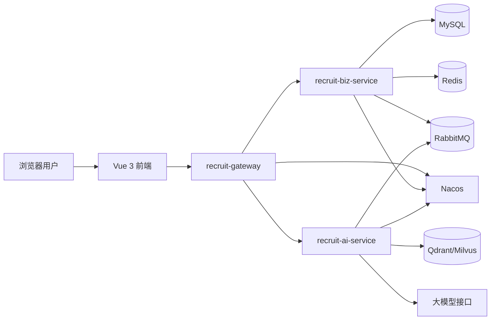
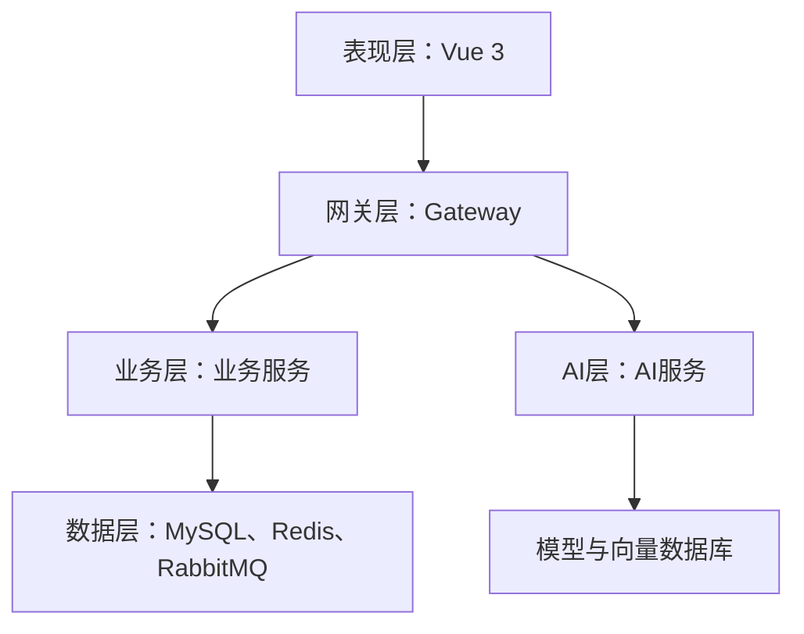
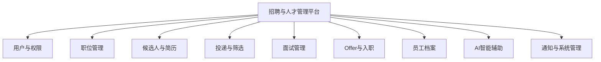
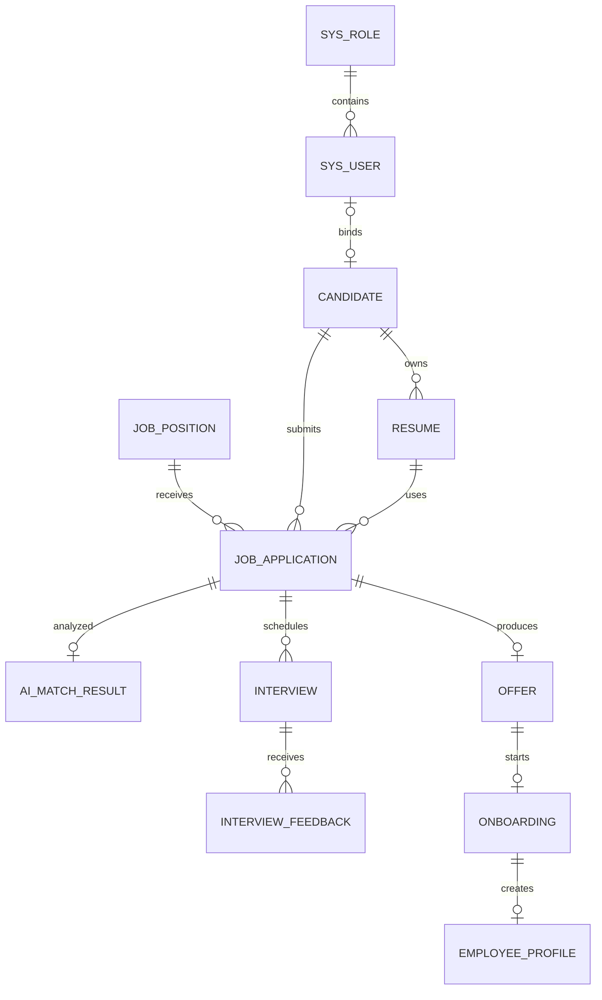
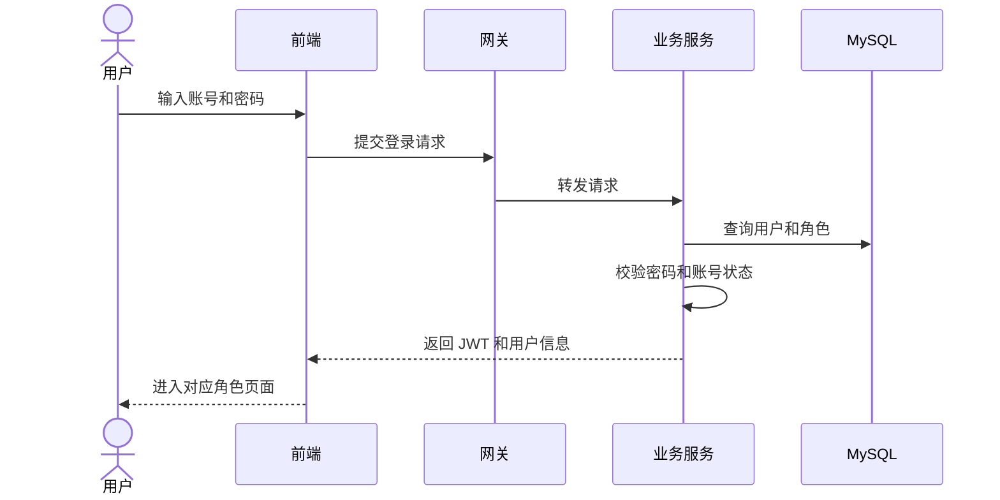
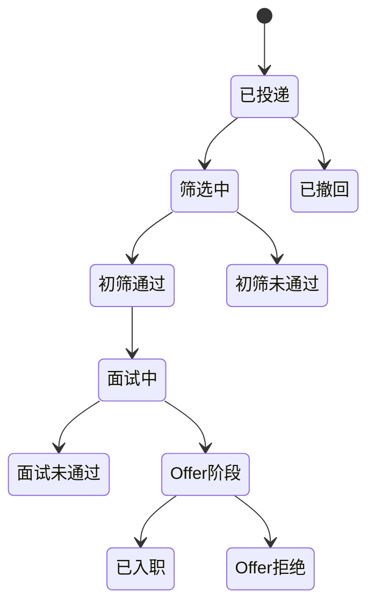
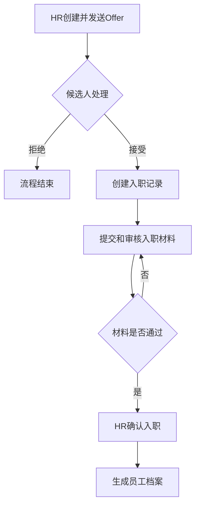
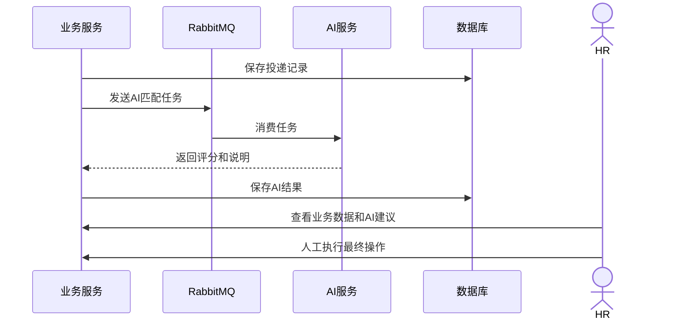

# 招聘与人才管理平台

# 软件系统设计说明书

武汉理工大学 2023zy1 班集中实习项目第 9 组

| 版本号 | 时间 | 小组成员 | 说明 |
|---|---|---|---|
| v1.0 | 2026-07-14 | 第 9 组成员 | 根据需求规格说明书完成系统设计。 |

## 目录

- 第一章 引言
- 第二章 设计概述
- 第三章 系统技术架构
- 第四章 系统概要设计
- 第五章 系统详细设计

## 第一章 引言

### 1.1 编写目的

本说明书以《招聘与人才管理平台-需求规格说明书》为依据，对系统架构、功能模块、数据库、接口和关键业务流程进行设计，为前后端开发、数据库建设、系统测试和项目验收提供参考。

需要查看字段级数据库、接口参数和异常处理时，请参阅[设计文档-详细版.md](./设计文档-详细版.md)。

### 1.2 设计范围

系统面向系统管理员、HR、面试官和候选人四类用户，主要覆盖以下业务：

- 用户登录、角色识别和权限控制。
- 职位发布、候选人和简历管理。
- 职位投递、简历筛选和面试安排。
- 面试反馈、Offer、入职和员工档案管理。
- 简历匹配、面试题生成、反馈摘要和离职风险分析等 AI 辅助功能。
- 站内通知、操作日志和基础配置。

系统优先保证招聘主流程可演示、可测试和可验收。AI 只提供分析和建议，不直接决定候选人的录用结果。

### 1.3 参考资料

| 资料名称 | 用途 |
|---|---|
| 《招聘与人才管理平台-需求规格说明书》 | 业务范围和功能需求依据。 |
| `recruit_smart_init.sql` | 数据库表结构依据。 |
| `recruit-smart-backend/pom.xml` | 后端模块和技术栈依据。 |
| `recruit-smart-frontend/package.json` | 前端技术栈依据。 |
| `recruit-smart-frontend/design.md` | 页面视觉和交互规范依据。 |

### 1.4 术语与缩略语

| 术语 | 说明 |
|---|---|
| JWT | 用于登录认证和接口鉴权的令牌。 |
| RBAC | 基于角色的权限控制。 |
| DTO | 接收和校验接口请求参数的数据对象。 |
| VO | 返回给前端的视图数据对象。 |
| RESTful API | 基于 HTTP 的资源化接口设计方式。 |
| Nacos | 微服务注册与发现组件。 |
| RabbitMQ | 用于异步任务和消息通知的消息队列。 |
| RAG | 结合外部知识检索的大模型生成方式。 |

## 第二章 设计概述

### 2.1 设计目标

系统设计目标如下：

1. 完成职位发布到员工入职的招聘业务闭环。
2. 明确四类角色的功能权限和数据范围。
3. 保证投递、面试、Offer 和入职状态正确流转。
4. 将传统业务服务与 AI 服务分离，避免 AI 故障阻断核心流程。
5. 保持模块清晰、接口统一，并支持后续扩展。

### 2.2 设计原则

- **业务优先**：先完成招聘主流程，再扩展统计、通知和智能功能。
- **职责清晰**：业务服务维护最终业务状态，AI 服务只返回辅助结果。
- **权限可靠**：前端控制页面入口，后端负责最终角色和数据权限校验。
- **状态受控**：业务状态只能通过规定的操作进行流转。
- **数据安全**：简历、薪资、面试评价和员工档案按最小权限访问。
- **便于扩展**：为缓存、消息队列、向量数据库和细粒度权限预留接口。

### 2.3 用户角色

| 角色 | 主要职责 |
|---|---|
| 系统管理员 | 管理用户、角色、基础配置和系统运行数据。 |
| HR | 管理职位、候选人、筛选、面试、Offer、入职和员工档案。 |
| 面试官 | 查看本人面试任务并提交评分、评价和录用建议。 |
| 候选人 | 维护个人资料和简历，投递职位并处理本人 Offer。 |

### 2.4 系统业务边界

传统业务服务负责用户权限和招聘主流程，并将最终状态保存到业务数据库。AI 服务负责简历匹配、面试题生成、反馈摘要和离职风险预测。

AI 可以生成评分、推荐理由、亮点和风险提示，但不得自动拒绝候选人、发送 Offer、确认入职或改变员工状态。所有关键业务决定必须由 HR、面试官或候选人完成。

## 第三章 系统技术架构

### 3.1 总体技术架构

系统采用前后端分离和微服务架构，前端通过网关访问传统业务服务和 AI 服务。



### 3.2 前端技术栈

| 技术 | 用途 |
|---|---|
| Vue 3 + TypeScript | 页面组件和类型约束。 |
| Vite | 开发和生产构建。 |
| Vue Router | 页面路由和角色守卫。 |
| Pinia | 登录用户、权限和界面状态。 |
| Axios | 后端接口调用。 |
| TanStack Vue Query | 列表查询、缓存和数据刷新。 |
| Element Plus | 表单、表格、分页和弹窗。 |
| ECharts | 招聘数据图表。 |
| Vitest | 前端单元测试。 |

前端页面和组件必须遵守 `recruit-smart-frontend/design.md`。组件库默认样式与设计规范冲突时，以设计规范为准。

### 3.3 后端技术栈

后端使用 Java 21、Spring Boot 3.2、Spring Cloud 和 Maven 多模块结构。

| 模块 | 主要职责 |
|---|---|
| `recruit-gateway` | 统一入口、路由转发、跨域和 Token 基础校验。 |
| `recruit-common` | 统一响应、异常、JWT 工具和通用类型。 |
| `recruit-biz-service` | 用户权限和招聘主流程，维护最终业务状态。 |
| `recruit-ai-service` | AI 匹配、生成、摘要和预测。 |
| `feign-api` | 微服务之间的接口契约。 |

业务服务内部采用 Controller、Service、Mapper 分层结构：

- Controller 负责参数接收和响应封装。
- Service 负责业务规则、权限、状态流转和事务。
- Mapper 使用 MyBatis-Plus 访问 MySQL。

### 3.4 数据和中间件

| 组件 | 用途 |
|---|---|
| MySQL 8.x | 保存招聘业务数据。 |
| Redis | 保存验证码、缓存、限流标记等临时数据。 |
| RabbitMQ | 处理 AI 任务和通知等异步消息。 |
| Nacos | 服务注册与发现。 |
| Qdrant/Milvus | 保存简历和职位文本向量。 |
| 文件存储 | 保存 PDF、Word 等简历文件。 |

## 第四章 系统概要设计

### 4.1 体系结构设计

系统分为表现层、网关层、业务层、AI 层和数据层。



前端负责页面展示和交互；网关提供统一入口；业务服务处理核心招聘规则；AI 服务提供智能辅助；数据库和中间件负责数据存储及异步处理。

### 4.2 整体功能结构



角色权限概要如下：

| 功能 | 管理员 | HR | 面试官 | 候选人 |
|---|---:|---:|---:|---:|
| 用户和角色管理 | 允许 | 受限 | 禁止 | 禁止 |
| 职位管理 | 可查看 | 允许 | 只读 | 查看开放职位 |
| 候选人和简历 | 可查看 | 允许 | 查看相关资料 | 管理本人资料 |
| 投递筛选 | 可查看 | 允许 | 禁止 | 投递和查看本人状态 |
| 面试管理 | 可查看 | 安排和查看 | 处理本人任务 | 查看本人安排 |
| Offer 和入职 | 可查看 | 允许 | 禁止 | 处理本人记录 |

### 4.3 功能模块概要设计

#### 4.3.1 用户与权限管理

系统采用账号密码登录，登录成功后返回 JWT。网关进行 Token 基础校验，业务服务继续校验角色和数据权限。

候选人登录账号保存在 `sys_user`，候选人业务资料保存在 `candidate`，两者通过 `user_id` 关联。面试官只能访问分配给自己的面试，候选人只能访问本人的简历、投递记录和 Offer。

#### 4.3.2 职位、候选人与简历管理

HR 可以创建、编辑、发布和关闭职位。只有招聘中的职位允许候选人投递。

候选人可以自注册，也可以由 HR 录入。一个候选人可以维护多份简历并设置默认简历。简历文件保存在文件存储中，数据库保存文件地址、解析文本和技能信息。

#### 4.3.3 投递与筛选管理

候选人选择职位和简历后提交投递。同一候选人不得重复投递同一职位。HR 可以查看投递列表，并结合简历、AI 评分和业务情况进行通过、拒绝或待定处理。

拒绝候选人时应记录拒绝原因。AI 评分只能作为参考，不能自动改变投递状态。

#### 4.3.4 面试管理

HR 为初筛通过的候选人创建面试安排，填写时间、面试官、方式和地点。系统应检查面试官和候选人的时间冲突。

面试官查看本人任务并提交评分、评价和录用建议。AI 可以生成面试题和反馈摘要，但必须保留面试官原始评价。

#### 4.3.5 Offer、入职和员工档案

HR 为面试通过的候选人创建并发送 Offer。候选人可以接受或拒绝，HR 可以在候选人接受前撤回。

候选人接受 Offer 后进入入职流程。入职材料审核通过并确认入职后，系统生成员工档案，同时更新候选人和投递状态。

#### 4.3.6 AI 智能辅助

AI 服务提供以下能力：

- 简历与职位匹配评分。
- 推荐理由、亮点和风险提示。
- 面试问题建议。
- 面试反馈摘要。
- 员工离职风险预测。

AI 结果应记录模型、生成时间和关联业务对象。AI 服务异常时，职位投递、人工筛选和面试反馈等基础功能仍应正常运行。

#### 4.3.7 系统管理与通知

系统在投递、筛选、面试、Offer 和入职等关键节点生成站内通知。管理员可维护拒绝原因、面试方式等基础配置，并查看关键操作记录。

### 4.4 数据库概要设计

数据库使用 MySQL 8.x，字符集为 `utf8mb4`。核心表使用 `BIGINT` 主键，并对账号、状态、职位、候选人、面试官和时间等常用查询字段建立索引。



核心数据表如下：

| 表名 | 作用 |
|---|---|
| `sys_role` | 保存角色信息。 |
| `sys_user` | 保存登录账号和角色。 |
| `job_position` | 保存职位信息和状态。 |
| `candidate` | 保存候选人业务资料。 |
| `resume` | 保存简历文件和解析结果。 |
| `job_application` | 保存职位投递和筛选状态。 |
| `ai_match_result` | 保存 AI 匹配结果。 |
| `interview` | 保存面试安排。 |
| `interview_feedback` | 保存面试评价。 |
| `offer` | 保存 Offer 信息和状态。 |
| `onboarding` | 保存入职办理状态。 |
| `employee_profile` | 保存员工档案。 |

通知、AI 任务、操作日志和字典表可根据后续实现进度增加，并同步更新数据库初始化脚本。

### 4.5 接口设计

系统接口采用 RESTful 风格，主要使用 JSON 交换数据，简历上传使用 `multipart/form-data`。受保护接口通过请求头携带 JWT。

统一返回结构如下：

```json
{
  "code": 200,
  "message": "success",
  "data": {}
}
```

分页结果的 `data` 包含 `total` 和 `records`。

主要接口如下：

| 模块 | 方法与路径 | 说明 |
|---|---|---|
| 登录 | `POST /auth/login` | 用户登录。 |
| 职位 | `GET /jobs` | 查询职位列表。 |
| 职位 | `POST /jobs` | 创建职位。 |
| 职位 | `PUT /jobs/{id}/publish` | 发布职位。 |
| 候选人 | `GET /candidates` | 查询候选人。 |
| 简历 | `POST /candidates/{id}/resumes` | 上传简历。 |
| 投递 | `POST /applications` | 提交职位投递。 |
| 筛选 | `PUT /applications/{id}/screen` | HR 处理筛选结果。 |
| 面试 | `POST /interviews` | 创建面试安排。 |
| 反馈 | `POST /interviews/{id}/feedback` | 提交面试反馈。 |
| Offer | `POST /offers` | 创建 Offer。 |
| Offer | `PUT /offers/{id}/decision` | 候选人接受或拒绝。 |
| 入职 | `PUT /onboardings/{id}/complete` | 确认入职。 |
| AI | `POST /api/ai/resume-match` | 简历与职位匹配。 |

登录、职位和 AI 匹配路径与当前工程保持一致，其他路径作为后续接口设计参考。

### 4.6 安全与可靠性设计

- 密码使用 BCrypt 等不可逆算法保存。
- 网关校验 Token，业务服务校验角色和数据归属。
- 日志不得输出密码、完整 Token、身份证号和完整简历正文。
- 简历文件下载必须经过权限校验。
- 投递、Offer、入职等关键操作使用事务和唯一索引防止重复数据。
- AI 和通知任务失败时记录原因并允许重试，不回滚已经成功的核心业务。

### 4.7 本章小结

本章完成了系统分层、功能模块、数据库和接口的概要设计。系统以投递记录为招聘流程核心，以传统业务服务作为最终状态的唯一维护者。

## 第五章 系统详细设计

### 5.1 功能模块详细设计

#### 5.1.1 登录流程



登录失败时返回统一提示，避免泄露账号是否存在。登录成功后，前端根据角色加载菜单和路由。

#### 5.1.2 投递和筛选流程

投递记录主要状态如下：



提交投递时，系统校验职位是否开放、简历是否属于当前候选人以及是否重复投递。投递成功后可异步触发 AI 匹配任务。

HR 处理筛选结果时，系统记录操作人、处理时间和拒绝原因。状态变更必须符合规定流程。

#### 5.1.3 面试流程

1. HR 为初筛通过的投递创建面试安排。
2. 系统检查面试时间冲突并保存面试任务。
3. 面试官查看候选人资料和 AI 面试题建议。
4. 面试官提交评分、评价和录用建议。
5. AI 可生成反馈摘要，HR 根据原始反馈作出最终判断。

#### 5.1.4 Offer 和入职流程



确认入职时，系统在同一事务中更新入职记录、投递状态和候选人状态，并生成员工档案，防止重复入职。

#### 5.1.5 AI 辅助流程



AI 分数范围为 0 至 100，并同时展示推荐理由、亮点和风险。AI 输出不得使用“绝对适合”或“一定录用”等确定性表述。

### 5.2 数据库详细设计

核心表的主要字段如下，完整字段和索引以 `recruit_smart_init.sql` 为准。

| 表名 | 主要字段 |
|---|---|
| `sys_role` | `id`、`role_code`、`role_name`。 |
| `sys_user` | `id`、`username`、`password`、`role_id`、`status`。 |
| `job_position` | `id`、`title`、`department`、`requirements`、`status`。 |
| `candidate` | `id`、`user_id`、`name`、`phone`、`education`、`current_status`。 |
| `resume` | `id`、`candidate_id`、`file_url`、`parsed_content`、`is_default`。 |
| `job_application` | `id`、`job_id`、`candidate_id`、`resume_id`、`status`、`reject_reason`。 |
| `ai_match_result` | `application_id`、`match_score`、`recommend_reason`、`risk_summary`。 |
| `interview` | `application_id`、`interviewer_id`、`interview_time`、`status`。 |
| `interview_feedback` | `interview_id`、`score`、`comment`、`suggestion`、`ai_summary`。 |
| `offer` | `application_id`、`salary`、`entry_date`、`status`。 |
| `onboarding` | `offer_id`、`candidate_id`、`material_status`、`status`。 |
| `employee_profile` | `candidate_id`、`employee_no`、`department`、`position`、`status`。 |

主要数据约束如下：

- 用户名和角色编码不能重复。
- 同一登录用户只能绑定一份候选人档案。
- 同一候选人不能重复投递同一职位。
- 同一投递只对应一条 Offer。
- 同一 Offer 只创建一条入职记录。
- 同一候选人只生成一份员工档案。

### 5.3 非功能设计

| 类型 | 设计要求 |
|---|---|
| 性能 | 列表使用分页和索引，简历解析及 AI 任务优先异步处理。 |
| 安全 | 使用 JWT、密码加密、角色权限和数据权限校验。 |
| 稳定性 | AI 服务异常不影响投递、筛选和面试等基础业务。 |
| 扩展性 | AI 服务与业务服务分离，可替换模型、向量库和通知渠道。 |
| 可测试性 | 重点测试角色权限、重复投递和各业务状态流转。 |

系统应支持不少于 200 个用户账号、500 条职位、5000 条候选人和 10000 条投递记录，并满足 50 个用户同时访问核心业务接口的实训演示要求。

### 5.4 本章小结

本章对登录、投递筛选、面试、Offer、入职和 AI 辅助等关键流程进行了详细说明，并给出核心表字段和非功能设计要求。后续若业务状态、接口或数据库结构发生调整，应同步更新需求文档、设计文档、初始化脚本和测试用例。
